Projeto Sucupira / Análise de Dados
================
2026-02-09

<!-- README.md is generated from README.Rmd. Please edit that file -->

## 👨‍🔬 Autores

- **Regivam Antonio de Saul**  
  Graduando em Agronomia - FEIS/Unesp  
  Email: <regivan.saul@unesp.br>

- **Witória de Oliveira Araujo**  
  Pós-graduando em Agronomia - FCAV/Unesp  
  Email: <witoria.araujo@unesp.br>

- **Rodrigo Baratiere Perim**  
  Pós-graduando em Agronomia - FCAV/Unesp  
  Email: <rodrigo.perim@unesp.br>

- **Prof. Dr. Alan Rodrigo Panosso**  
  Coorientador — Departamento de Ciências Exatas - FCAV/Unesp  
  Email: <alan.panosso@unesp.br>

- **Prof. Dr. Mario Luiz Teixeira de Moraes**  
  Coorientador — Departamento de Fitotecnia, Tecnologia de Alimentos e
  Sócio-Economia - FEIS/Unesp  
  Email: [mario.moraes@unesp.br](mailto:%20mario.moraes@unesp.br)

### Carregando Pacotes

``` r
library(tidyverse)
library(spdep)
library(gstat)
library(sf)
library(sp)
source("R/my-functions.R")
```

### Carregando os banco de dados

``` r
lsgo<-readxl::read_xlsx("data-raw/GO-LAG-Pop-Sucupira1.xlsx") |> 
  janitor::clean_names()
selms<-readxl::read_xlsx("data-raw/MS-SEL-Pop-Sucupira1.xlsx") |> 
  janitor::clean_names()
aposp<-readxl::read_xlsx("data-raw/SP-APO-Pop-Sucupira1.xlsx") |> 
  janitor::clean_names()

# alteração do sistema de coordenadas
data_set <- rbind(lsgo,selms,aposp) |> 
  # st_as_sf(coords = c("easting", "northing"),
  #          crs = 31983) %>%      # CRS de origem
  # st_transform(crs = 4326) %>%   # WGS84 (lat/long)
  mutate(
    longitude = easting,
    latitude = northing
    # longitude = st_coordinates(.)[,1],
    # latitude  = st_coordinates(.)[,2]
  ) #%>%
  # st_drop_geometry()
```

### Grid amostral e Gráficos

Os gráficos X–Y com gradiente de cor foram utilizados para representar a
distribuição espacial das variáveis dentro de cada população, por padrão
utilizamos 3 classes por população, em que a tonalidade indica a
magnitude dos valores observados. Essa abordagem permite identificar
visualmente gradientes espaciais, manchas e possíveis padrões de
agregação ou heterogeneidade intra-populacional.

Os boxplots foram empregados para comparar a distribuição das variáveis
entre populações, evidenciando diferenças de mediana, dispersão e
presença de valores extremos.

Em conjunto, essas visualizações auxiliam na interpretação dos
resultados de correlação e autocorrelação espacial, bem como na
identificação de padrões relevantes para análises estatísticas
subsequentes.

``` r
names_vari <- names(data_set |> select(hc_m:s_enxofre))
walk(names_vari,~{
  plot_map <- data_set |>
    select(populacao,longitude,latitude,!!sym(.x)) |>
    group_by(populacao) |>
    mutate(
      classe = cut(!!sym(.x),3)
    ) |>
    ggplot(aes(x=longitude, y=latitude,colour = classe)) +
    geom_point() +
    facet_wrap(~populacao,scale="free",ncol=2)+
    theme_bw()+
    labs(
      colour = .x
    )
  
    plot_box <- data_set |> 
    select(populacao,longitude,latitude,!!sym(.x)) |> 
    group_by(populacao) |> 
    ggplot(aes(y=!!sym(.x), fill = populacao)) +
    geom_boxplot() +
    theme_bw()+
    labs(
      fill = "populacao"
    ) + scale_fill_viridis_d(option = "B")
    
    print(plot_map)
    print(plot_box)
})
```

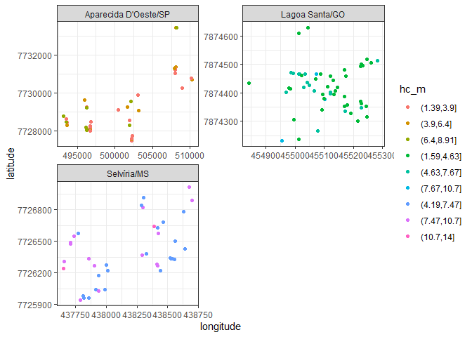<!-- -->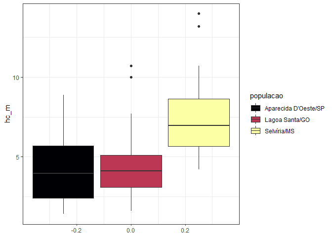<!-- -->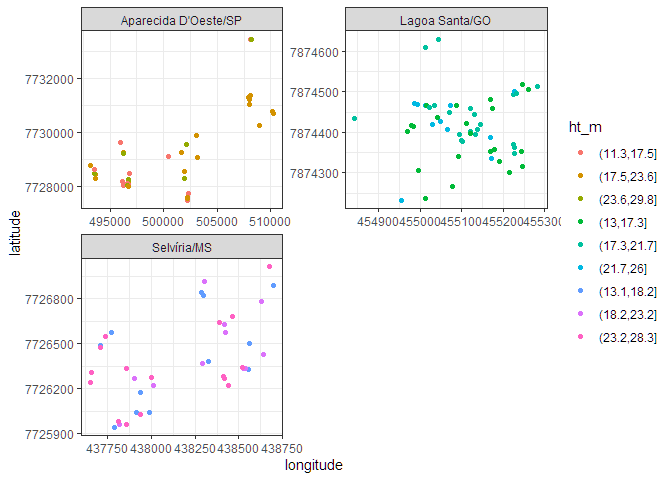<!-- -->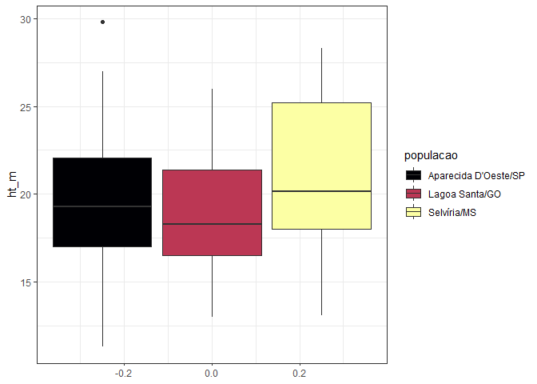<!-- --><!-- -->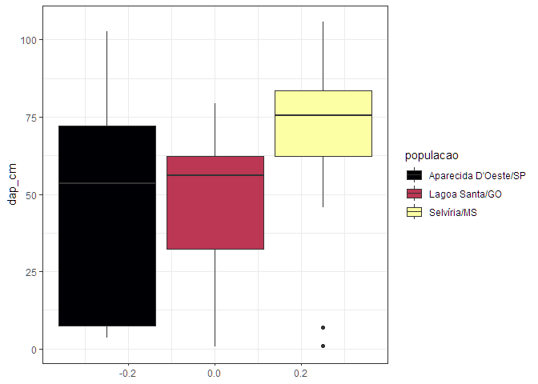<!-- -->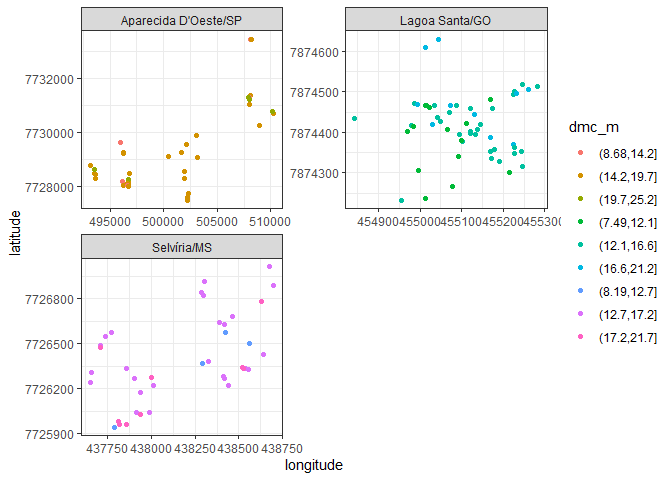<!-- --><!-- -->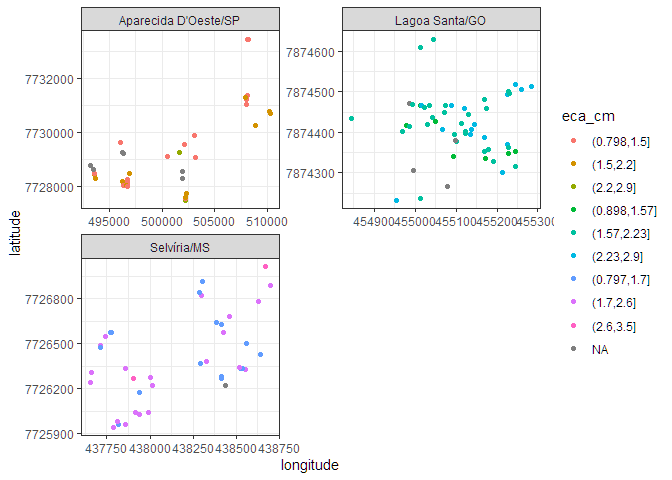<!-- -->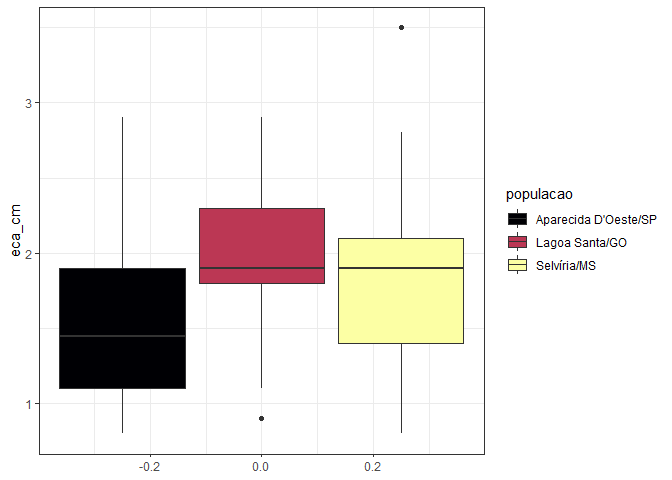<!-- -->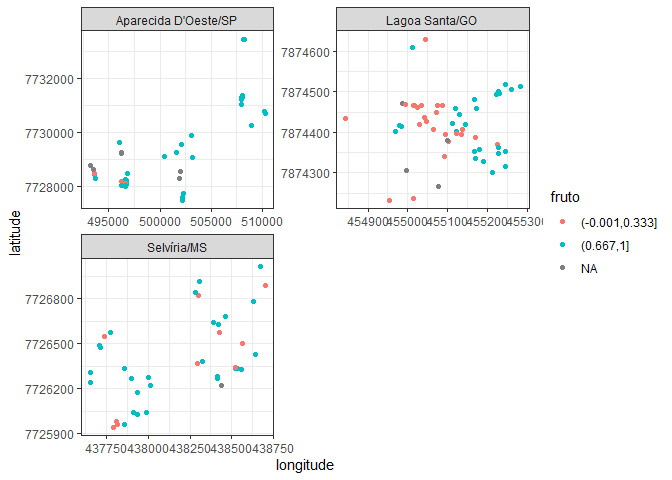<!-- -->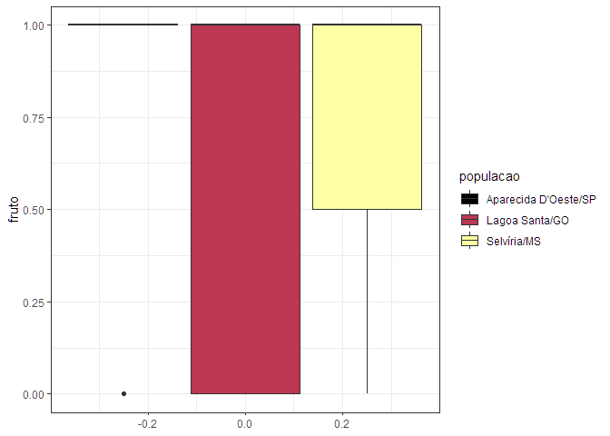<!-- -->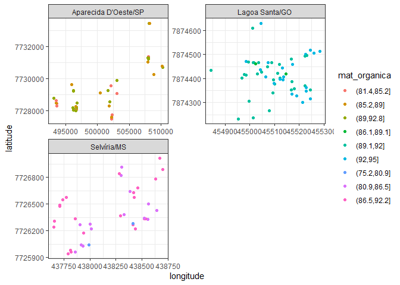<!-- -->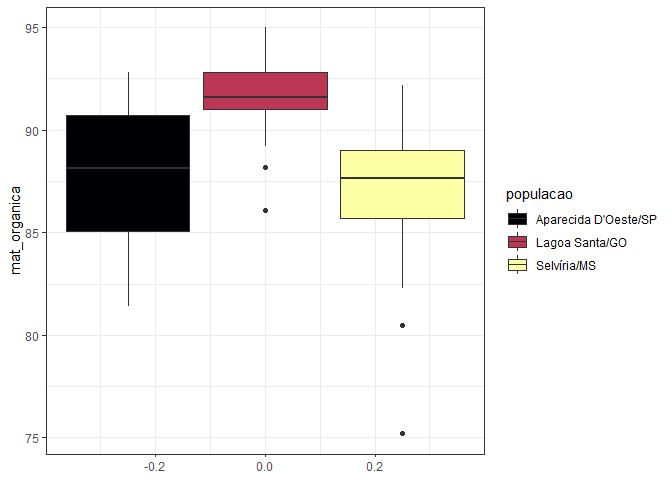<!-- -->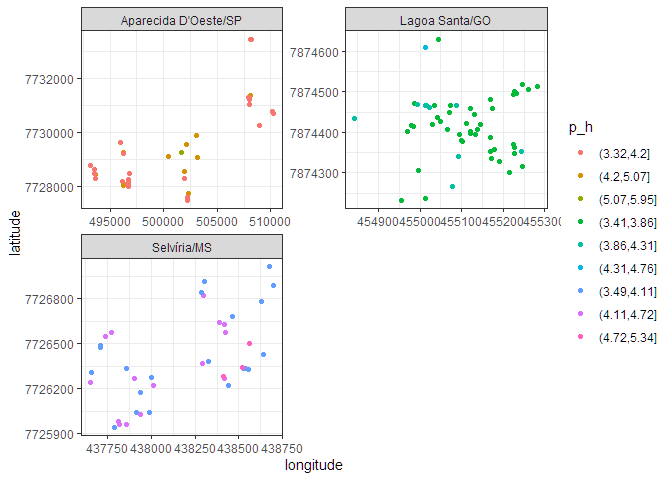<!-- -->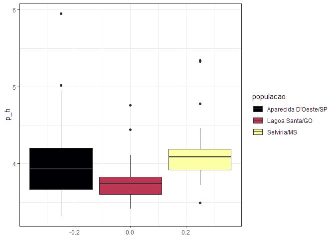<!-- --><!-- --><!-- --><!-- -->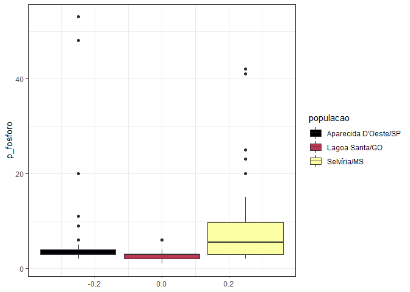<!-- -->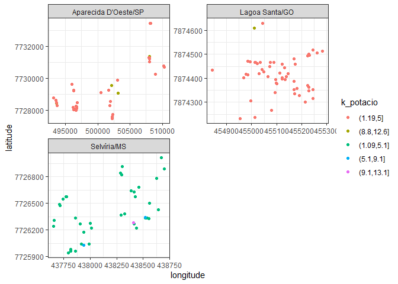<!-- -->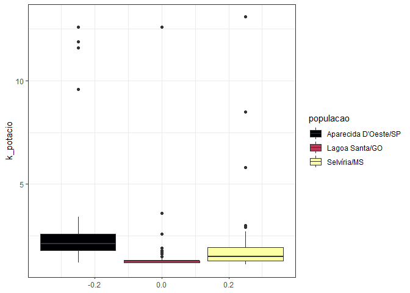<!-- -->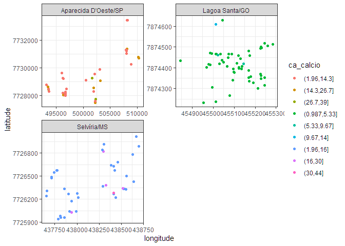<!-- -->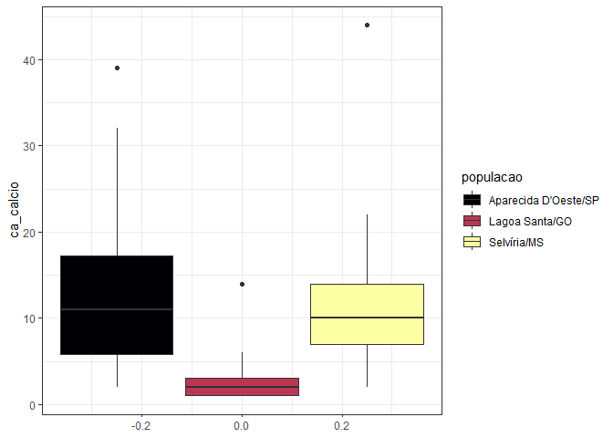<!-- -->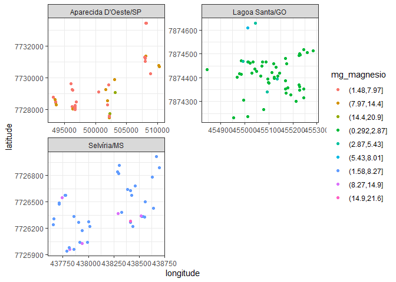<!-- -->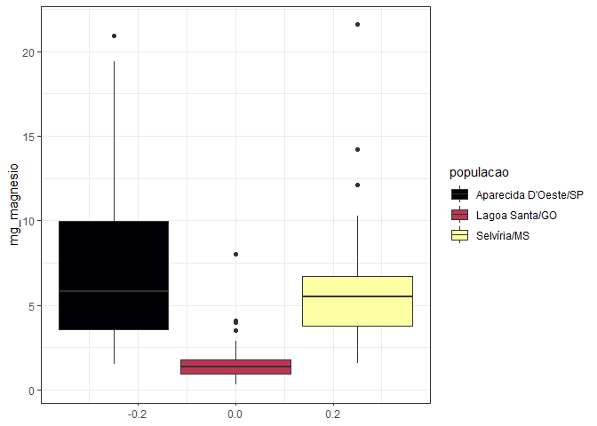<!-- --><!-- -->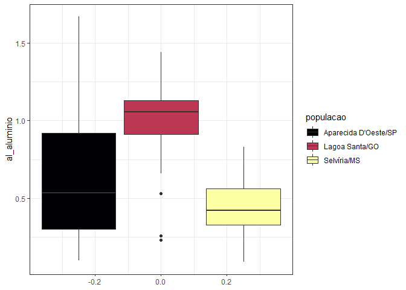<!-- -->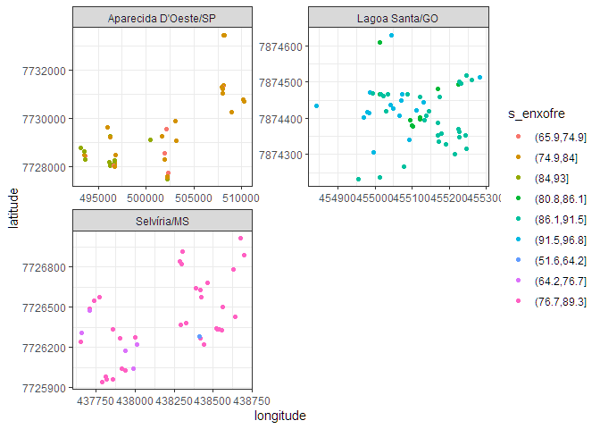<!-- -->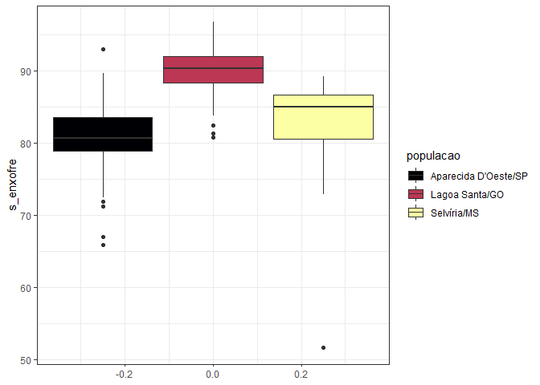<!-- -->

### Estatística Descritiva

A estatística descritiva foi utilizada para caracterizar a distribuição
das variáveis analisadas em cada população, incluindo medidas de posição
e dispersão, bem como os coeficientes de assimetria e curtose.

O coeficiente de assimetria permite avaliar desvios em relação à
simetria da distribuição, indicando predominância de valores mais altos
ou mais baixos. A curtose descreve o grau de concentração dos dados em
torno da média, auxiliando na identificação de distribuições mais
achatadas ou mais concentradas.

``` r
data_set |> 
  select(populacao, hc_m:s_enxofre) |> 
  group_by(populacao) |> 
  reframe( across(
    .cols = hc_m:s_enxofre,
    .fns = estat_desc,
    .names = "{.col}"
  )) |>
  ungroup() |> 
  add_column(estat = rep(estat_names,3)) |> 
  relocate(estat) |> 
  writexl::write_xlsx("output/estatistica-descritiva.xlsx")
```

### Correlação linear por população

A análise de correlação linear foi realizada separadamente para cada
população, com o objetivo de avaliar as relações entre as variáveis
dentro de um mesmo contexto ambiental e espacial, evitando efeitos de
confusão associados às diferenças entre localidades.

As matrizes de correlação foram visualizadas por meio de corrplot,
permitindo identificar a direção (positiva ou negativa) e a intensidade
das correlações entre variáveis, bem como padrões consistentes ou
contrastantes entre as populações analisadas.

Ideal para interpretação das relações planta–solo em nível
intra-populacional.

``` r
data_set |> 
  filter(populacao == "Lagoa Santa/GO") |> 
  select(hc_m:s_enxofre) |> 
  cor(use = "complete.obs") |> 
  corrplot::corrplot( method = "color",
         outline = T,,
         addgrid.col = "darkgray",cl.pos = "r", tl.col = "black",
         tl.cex = 1, cl.cex = 1, type = "upper", bg="azure2",
         diag = FALSE,
         # addCoef.col = "black",
         cl.ratio = 0.2,
         cl.length = 5,
         number.cex = 0.8)
```

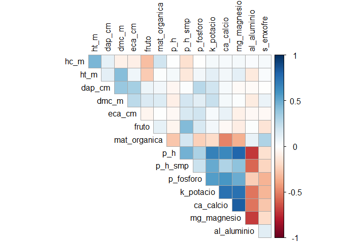<!-- --> \###
Correlação linear - por população

``` r
data_set |> 
  filter(populacao == "Selvíria/MS") |> 
  select(hc_m:s_enxofre) |> 
  cor(use = "complete.obs") |> 
  corrplot::corrplot( method = "color",
         outline = T,,
         addgrid.col = "darkgray",cl.pos = "r", tl.col = "black",
         tl.cex = 1, cl.cex = 1, type = "upper", bg="azure2",
         diag = FALSE,
         # addCoef.col = "black",
         cl.ratio = 0.2,
         cl.length = 5,
         number.cex = 0.8)
```

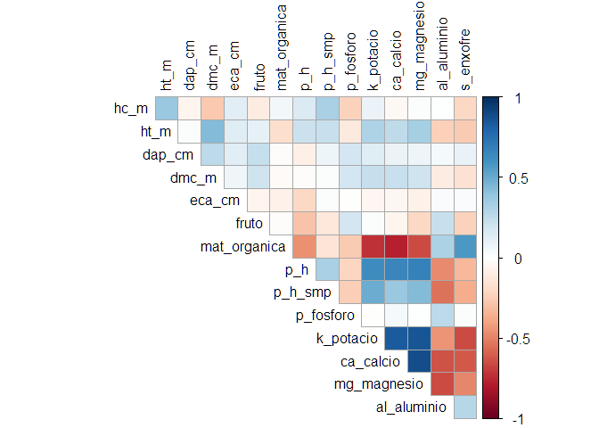<!-- --> \###
Correlação linear

``` r
data_set |> 
  filter(populacao == "Aparecida D'Oeste/SP") |> 
  select(hc_m:s_enxofre) |> 
  cor(use = "complete.obs") |> 
  corrplot::corrplot( method = "color",
         outline = T,,
         addgrid.col = "darkgray",cl.pos = "r", tl.col = "black",
         tl.cex = 1, cl.cex = 1, type = "upper", bg="azure2",
         diag = FALSE,
         # addCoef.col = "black",
         cl.ratio = 0.2,
         cl.length = 5,
         number.cex = 0.8)
```

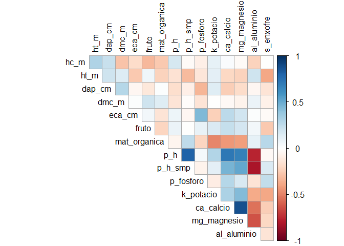<!-- -->

### Autocorrelação espacial (Moran’s I)

O Índice de Moran é uma medida de autocorrelação espacial global que
avalia se valores de uma variável observados em pontos próximos no
espaço tendem a ser mais semelhantes (autocorrelação positiva), mais
diferentes (autocorrelação negativa) ou distribuídos aleatoriamente.

**Valores de Moran’s I próximos ao valor esperado sob aleatoriedade
indicam ausência de estrutura espacial. Valores significativamente
maiores que o esperado indicam autocorrelação espacial positiva
(agregação), enquanto valores menores indicam autocorrelação negativa
(repulsão).**

A significância estatística é avaliada por teste de randomização. Um
p-valor baixo (ex.: p \< 0,05) indica que o padrão espacial observado
difere do acaso, na escala definida pela matriz de vizinhança utilizada.

``` r
coords <- data_set  |> 
  filter(populacao == "Lagoa Santa/GO")  |>  
  select(longitude, latitude)

nb <- dnearneigh(as.matrix(coords), 5, 300)  # ajuste distância
lw <- nb2listw(nb, style = "W")

walk(names_vari, ~{
  x <- data_set |> filter(populacao == "Lagoa Santa/GO")|> pull(!!sym(.x))
  x[is.na(x)] <- mean(x,na.rm=TRUE) 
  print(paste0("|---------- ",.x," ---------|"))
  print(moran.test(x, lw))
  
})
#> [1] "|---------- hc_m ---------|"
#> 
#>  Moran I test under randomisation
#> 
#> data:  x  
#> weights: lw    
#> 
#> Moran I statistic standard deviate = 1.2892, p-value = 0.09867
#> alternative hypothesis: greater
#> sample estimates:
#> Moran I statistic       Expectation          Variance 
#>     -1.060348e-02     -1.886792e-02      4.109625e-05 
#> 
#> [1] "|---------- ht_m ---------|"
#> 
#>  Moran I test under randomisation
#> 
#> data:  x  
#> weights: lw    
#> 
#> Moran I statistic standard deviate = 1.6708, p-value = 0.04738
#> alternative hypothesis: greater
#> sample estimates:
#> Moran I statistic       Expectation          Variance 
#>     -7.905083e-03     -1.886792e-02      4.305184e-05 
#> 
#> [1] "|---------- dap_cm ---------|"
#> 
#>  Moran I test under randomisation
#> 
#> data:  x  
#> weights: lw    
#> 
#> Moran I statistic standard deviate = -0.038669, p-value = 0.5154
#> alternative hypothesis: greater
#> sample estimates:
#> Moran I statistic       Expectation          Variance 
#>     -1.912247e-02     -1.886792e-02      4.333142e-05 
#> 
#> [1] "|---------- dmc_m ---------|"
#> 
#>  Moran I test under randomisation
#> 
#> data:  x  
#> weights: lw    
#> 
#> Moran I statistic standard deviate = 1.2781, p-value = 0.1006
#> alternative hypothesis: greater
#> sample estimates:
#> Moran I statistic       Expectation          Variance 
#>     -1.049004e-02     -1.886792e-02      4.296434e-05 
#> 
#> [1] "|---------- eca_cm ---------|"
#> 
#>  Moran I test under randomisation
#> 
#> data:  x  
#> weights: lw    
#> 
#> Moran I statistic standard deviate = 0.93631, p-value = 0.1746
#> alternative hypothesis: greater
#> sample estimates:
#> Moran I statistic       Expectation          Variance 
#>     -1.276372e-02     -1.886792e-02      4.250254e-05 
#> 
#> [1] "|---------- fruto ---------|"
#> 
#>  Moran I test under randomisation
#> 
#> data:  x  
#> weights: lw    
#> 
#> Moran I statistic standard deviate = 3.8675, p-value = 5.498e-05
#> alternative hypothesis: greater
#> sample estimates:
#> Moran I statistic       Expectation          Variance 
#>      6.834845e-03     -1.886792e-02      4.416769e-05 
#> 
#> [1] "|---------- mat_organica ---------|"
#> 
#>  Moran I test under randomisation
#> 
#> data:  x  
#> weights: lw    
#> 
#> Moran I statistic standard deviate = 1.0341, p-value = 0.1505
#> alternative hypothesis: greater
#> sample estimates:
#> Moran I statistic       Expectation          Variance 
#>     -1.221018e-02     -1.886792e-02      4.145162e-05 
#> 
#> [1] "|---------- p_h ---------|"
#> 
#>  Moran I test under randomisation
#> 
#> data:  x  
#> weights: lw    
#> 
#> Moran I statistic standard deviate = 1.9515, p-value = 0.0255
#> alternative hypothesis: greater
#> sample estimates:
#> Moran I statistic       Expectation          Variance 
#>     -6.916190e-03     -1.886792e-02      3.750707e-05 
#> 
#> [1] "|---------- p_h_smp ---------|"
#> 
#>  Moran I test under randomisation
#> 
#> data:  x  
#> weights: lw    
#> 
#> Moran I statistic standard deviate = 1.1199, p-value = 0.1314
#> alternative hypothesis: greater
#> sample estimates:
#> Moran I statistic       Expectation          Variance 
#>     -1.162491e-02     -1.886792e-02      4.183152e-05 
#> 
#> [1] "|---------- p_fosforo ---------|"
#> 
#>  Moran I test under randomisation
#> 
#> data:  x  
#> weights: lw    
#> 
#> Moran I statistic standard deviate = 0.71946, p-value = 0.2359
#> alternative hypothesis: greater
#> sample estimates:
#> Moran I statistic       Expectation          Variance 
#>     -1.433409e-02     -1.886792e-02      3.971176e-05 
#> 
#> [1] "|---------- k_potacio ---------|"
#> 
#>  Moran I test under randomisation
#> 
#> data:  x  
#> weights: lw    
#> 
#> Moran I statistic standard deviate = 2.4313, p-value = 0.007522
#> alternative hypothesis: greater
#> sample estimates:
#> Moran I statistic       Expectation          Variance 
#>     -1.208263e-02     -1.886792e-02      7.788518e-06 
#> 
#> [1] "|---------- ca_calcio ---------|"
#> 
#>  Moran I test under randomisation
#> 
#> data:  x  
#> weights: lw    
#> 
#> Moran I statistic standard deviate = 1.1775, p-value = 0.1195
#> alternative hypothesis: greater
#> sample estimates:
#> Moran I statistic       Expectation          Variance 
#>     -1.240098e-02     -1.886792e-02      3.016313e-05 
#> 
#> [1] "|---------- mg_magnesio ---------|"
#> 
#>  Moran I test under randomisation
#> 
#> data:  x  
#> weights: lw    
#> 
#> Moran I statistic standard deviate = 3.2213, p-value = 0.000638
#> alternative hypothesis: greater
#> sample estimates:
#> Moran I statistic       Expectation          Variance 
#>     -2.069708e-04     -1.886792e-02      3.355812e-05 
#> 
#> [1] "|---------- al_aluminio ---------|"
#> 
#>  Moran I test under randomisation
#> 
#> data:  x  
#> weights: lw    
#> 
#> Moran I statistic standard deviate = 4.4586, p-value = 4.126e-06
#> alternative hypothesis: greater
#> sample estimates:
#> Moran I statistic       Expectation          Variance 
#>      0.0095907609     -0.0188679245      0.0000407419 
#> 
#> [1] "|---------- s_enxofre ---------|"
#> 
#>  Moran I test under randomisation
#> 
#> data:  x  
#> weights: lw    
#> 
#> Moran I statistic standard deviate = -0.18538, p-value = 0.5735
#> alternative hypothesis: greater
#> sample estimates:
#> Moran I statistic       Expectation          Variance 
#>     -2.007693e-02     -1.886792e-02      4.253323e-05
```

``` r
coords <- data_set  |> 
  filter(populacao == "Selvíria/MS")  |>  
  select(longitude, latitude)

nb <- dnearneigh(as.matrix(coords), 5, 500)  # ajuste distância
lw <- nb2listw(nb, style = "W")

walk(names_vari, ~{
  x <- data_set |> filter(populacao == "Selvíria/MS")|> pull(!!sym(.x))
  x[is.na(x)] <- mean(x,na.rm=TRUE) 
  print(paste0("|---------- ",.x," ---------|"))
  print(moran.test(x, lw))
  
})
#> [1] "|---------- hc_m ---------|"
#> 
#>  Moran I test under randomisation
#> 
#> data:  x  
#> weights: lw    
#> 
#> Moran I statistic standard deviate = -0.65149, p-value = 0.7426
#> alternative hypothesis: greater
#> sample estimates:
#> Moran I statistic       Expectation          Variance 
#>      -0.053694944      -0.025641026       0.001854261 
#> 
#> [1] "|---------- ht_m ---------|"
#> 
#>  Moran I test under randomisation
#> 
#> data:  x  
#> weights: lw    
#> 
#> Moran I statistic standard deviate = -0.16222, p-value = 0.5644
#> alternative hypothesis: greater
#> sample estimates:
#> Moran I statistic       Expectation          Variance 
#>      -0.032837086      -0.025641026       0.001967695 
#> 
#> [1] "|---------- dap_cm ---------|"
#> 
#>  Moran I test under randomisation
#> 
#> data:  x  
#> weights: lw    
#> 
#> Moran I statistic standard deviate = 0.15944, p-value = 0.4367
#> alternative hypothesis: greater
#> sample estimates:
#> Moran I statistic       Expectation          Variance 
#>       -0.01915098       -0.02564103        0.00165698 
#> 
#> [1] "|---------- dmc_m ---------|"
#> 
#>  Moran I test under randomisation
#> 
#> data:  x  
#> weights: lw    
#> 
#> Moran I statistic standard deviate = -0.7317, p-value = 0.7678
#> alternative hypothesis: greater
#> sample estimates:
#> Moran I statistic       Expectation          Variance 
#>      -0.057545264      -0.025641026       0.001901227 
#> 
#> [1] "|---------- eca_cm ---------|"
#> 
#>  Moran I test under randomisation
#> 
#> data:  x  
#> weights: lw    
#> 
#> Moran I statistic standard deviate = 0.77491, p-value = 0.2192
#> alternative hypothesis: greater
#> sample estimates:
#> Moran I statistic       Expectation          Variance 
#>       0.007428764      -0.025641026       0.001821233 
#> 
#> [1] "|---------- fruto ---------|"
#> 
#>  Moran I test under randomisation
#> 
#> data:  x  
#> weights: lw    
#> 
#> Moran I statistic standard deviate = -0.42419, p-value = 0.6643
#> alternative hypothesis: greater
#> sample estimates:
#> Moran I statistic       Expectation          Variance 
#>      -0.044352109      -0.025641026       0.001945691 
#> 
#> [1] "|---------- mat_organica ---------|"
#> 
#>  Moran I test under randomisation
#> 
#> data:  x  
#> weights: lw    
#> 
#> Moran I statistic standard deviate = 1.424, p-value = 0.07722
#> alternative hypothesis: greater
#> sample estimates:
#> Moran I statistic       Expectation          Variance 
#>        0.03341572       -0.02564103        0.00171986 
#> 
#> [1] "|---------- p_h ---------|"
#> 
#>  Moran I test under randomisation
#> 
#> data:  x  
#> weights: lw    
#> 
#> Moran I statistic standard deviate = -0.22548, p-value = 0.5892
#> alternative hypothesis: greater
#> sample estimates:
#> Moran I statistic       Expectation          Variance 
#>       -0.03481936       -0.02564103        0.00165703 
#> 
#> [1] "|---------- p_h_smp ---------|"
#> 
#>  Moran I test under randomisation
#> 
#> data:  x  
#> weights: lw    
#> 
#> Moran I statistic standard deviate = 0.13024, p-value = 0.4482
#> alternative hypothesis: greater
#> sample estimates:
#> Moran I statistic       Expectation          Variance 
#>      -0.020051885      -0.025641026       0.001841576 
#> 
#> [1] "|---------- p_fosforo ---------|"
#> 
#>  Moran I test under randomisation
#> 
#> data:  x  
#> weights: lw    
#> 
#> Moran I statistic standard deviate = -0.16956, p-value = 0.5673
#> alternative hypothesis: greater
#> sample estimates:
#> Moran I statistic       Expectation          Variance 
#>       -0.03265784       -0.02564103        0.00171260 
#> 
#> [1] "|---------- k_potacio ---------|"
#> 
#>  Moran I test under randomisation
#> 
#> data:  x  
#> weights: lw    
#> 
#> Moran I statistic standard deviate = -0.10478, p-value = 0.5417
#> alternative hypothesis: greater
#> sample estimates:
#> Moran I statistic       Expectation          Variance 
#>      -0.029203472      -0.025641026       0.001156041 
#> 
#> [1] "|---------- ca_calcio ---------|"
#> 
#>  Moran I test under randomisation
#> 
#> data:  x  
#> weights: lw    
#> 
#> Moran I statistic standard deviate = 0.92111, p-value = 0.1785
#> alternative hypothesis: greater
#> sample estimates:
#> Moran I statistic       Expectation          Variance 
#>       0.009236546      -0.025641026       0.001433738 
#> 
#> [1] "|---------- mg_magnesio ---------|"
#> 
#>  Moran I test under randomisation
#> 
#> data:  x  
#> weights: lw    
#> 
#> Moran I statistic standard deviate = 0.50368, p-value = 0.3072
#> alternative hypothesis: greater
#> sample estimates:
#> Moran I statistic       Expectation          Variance 
#>      -0.005690715      -0.025641026       0.001568881 
#> 
#> [1] "|---------- al_aluminio ---------|"
#> 
#>  Moran I test under randomisation
#> 
#> data:  x  
#> weights: lw    
#> 
#> Moran I statistic standard deviate = 0.76152, p-value = 0.2232
#> alternative hypothesis: greater
#> sample estimates:
#> Moran I statistic       Expectation          Variance 
#>       0.007949595      -0.025641026       0.001945708 
#> 
#> [1] "|---------- s_enxofre ---------|"
#> 
#>  Moran I test under randomisation
#> 
#> data:  x  
#> weights: lw    
#> 
#> Moran I statistic standard deviate = 2.5927, p-value = 0.004761
#> alternative hypothesis: greater
#> sample estimates:
#> Moran I statistic       Expectation          Variance 
#>       0.072643402      -0.025641026       0.001437004
```

``` r
coords <- data_set  |> 
  filter(populacao == "Aparecida D'Oeste/SP")  |>  
  select(longitude, latitude)

nb <- dnearneigh(as.matrix(coords), 5, 5100)  # ajuste distância
lw <- nb2listw(nb, style = "W")

walk(names_vari, ~{
  x <- data_set |> filter(populacao == "Aparecida D'Oeste/SP")|> pull(!!sym(.x))
  x[is.na(x)] <- mean(x,na.rm=TRUE) 
  print(paste0("|---------- ",.x," ---------|"))
  print(moran.test(x, lw))
  
})
#> [1] "|---------- hc_m ---------|"
#> 
#>  Moran I test under randomisation
#> 
#> data:  x  
#> weights: lw    
#> 
#> Moran I statistic standard deviate = 0.50784, p-value = 0.3058
#> alternative hypothesis: greater
#> sample estimates:
#> Moran I statistic       Expectation          Variance 
#>     -0.0001252212     -0.0256410256      0.0025244091 
#> 
#> [1] "|---------- ht_m ---------|"
#> 
#>  Moran I test under randomisation
#> 
#> data:  x  
#> weights: lw    
#> 
#> Moran I statistic standard deviate = -0.61418, p-value = 0.7305
#> alternative hypothesis: greater
#> sample estimates:
#> Moran I statistic       Expectation          Variance 
#>      -0.056165451      -0.025641026       0.002470066 
#> 
#> [1] "|---------- dap_cm ---------|"
#> 
#>  Moran I test under randomisation
#> 
#> data:  x  
#> weights: lw    
#> 
#> Moran I statistic standard deviate = 0.83256, p-value = 0.2025
#> alternative hypothesis: greater
#> sample estimates:
#> Moran I statistic       Expectation          Variance 
#>        0.01660582       -0.02564103        0.00257486 
#> 
#> [1] "|---------- dmc_m ---------|"
#> 
#>  Moran I test under randomisation
#> 
#> data:  x  
#> weights: lw    
#> 
#> Moran I statistic standard deviate = 0.86456, p-value = 0.1936
#> alternative hypothesis: greater
#> sample estimates:
#> Moran I statistic       Expectation          Variance 
#>       0.016311996      -0.025641026       0.002354678 
#> 
#> [1] "|---------- eca_cm ---------|"
#> 
#>  Moran I test under randomisation
#> 
#> data:  x  
#> weights: lw    
#> 
#> Moran I statistic standard deviate = -0.48749, p-value = 0.687
#> alternative hypothesis: greater
#> sample estimates:
#> Moran I statistic       Expectation          Variance 
#>      -0.049655630      -0.025641026       0.002426676 
#> 
#> [1] "|---------- fruto ---------|"
#> 
#>  Moran I test under randomisation
#> 
#> data:  x  
#> weights: lw    
#> 
#> Moran I statistic standard deviate = 1.7713, p-value = 0.03826
#> alternative hypothesis: greater
#> sample estimates:
#> Moran I statistic       Expectation          Variance 
#>       0.051646587      -0.025641026       0.001903882 
#> 
#> [1] "|---------- mat_organica ---------|"
#> 
#>  Moran I test under randomisation
#> 
#> data:  x  
#> weights: lw    
#> 
#> Moran I statistic standard deviate = -0.24528, p-value = 0.5969
#> alternative hypothesis: greater
#> sample estimates:
#> Moran I statistic       Expectation          Variance 
#>      -0.038042810      -0.025641026       0.002556393 
#> 
#> [1] "|---------- p_h ---------|"
#> 
#>  Moran I test under randomisation
#> 
#> data:  x  
#> weights: lw    
#> 
#> Moran I statistic standard deviate = 4.5487, p-value = 2.699e-06
#> alternative hypothesis: greater
#> sample estimates:
#> Moran I statistic       Expectation          Variance 
#>       0.190623204      -0.025641026       0.002260448 
#> 
#> [1] "|---------- p_h_smp ---------|"
#> 
#>  Moran I test under randomisation
#> 
#> data:  x  
#> weights: lw    
#> 
#> Moran I statistic standard deviate = 3.1007, p-value = 0.0009653
#> alternative hypothesis: greater
#> sample estimates:
#> Moran I statistic       Expectation          Variance 
#>        0.12929118       -0.02564103        0.00249668 
#> 
#> [1] "|---------- p_fosforo ---------|"
#> 
#>  Moran I test under randomisation
#> 
#> data:  x  
#> weights: lw    
#> 
#> Moran I statistic standard deviate = 0.25483, p-value = 0.3994
#> alternative hypothesis: greater
#> sample estimates:
#> Moran I statistic       Expectation          Variance 
#>      -0.015437078      -0.025641026       0.001603344 
#> 
#> [1] "|---------- k_potacio ---------|"
#> 
#>  Moran I test under randomisation
#> 
#> data:  x  
#> weights: lw    
#> 
#> Moran I statistic standard deviate = -0.094546, p-value = 0.5377
#> alternative hypothesis: greater
#> sample estimates:
#> Moran I statistic       Expectation          Variance 
#>      -0.029989707      -0.025641026       0.002115597 
#> 
#> [1] "|---------- ca_calcio ---------|"
#> 
#>  Moran I test under randomisation
#> 
#> data:  x  
#> weights: lw    
#> 
#> Moran I statistic standard deviate = 2.226, p-value = 0.01301
#> alternative hypothesis: greater
#> sample estimates:
#> Moran I statistic       Expectation          Variance 
#>       0.084158803      -0.025641026       0.002433036 
#> 
#> [1] "|---------- mg_magnesio ---------|"
#> 
#>  Moran I test under randomisation
#> 
#> data:  x  
#> weights: lw    
#> 
#> Moran I statistic standard deviate = 2.0696, p-value = 0.01924
#> alternative hypothesis: greater
#> sample estimates:
#> Moran I statistic       Expectation          Variance 
#>       0.076144327      -0.025641026       0.002418789 
#> 
#> [1] "|---------- al_aluminio ---------|"
#> 
#>  Moran I test under randomisation
#> 
#> data:  x  
#> weights: lw    
#> 
#> Moran I statistic standard deviate = 4.8176, p-value = 7.264e-07
#> alternative hypothesis: greater
#> sample estimates:
#> Moran I statistic       Expectation          Variance 
#>       0.215406962      -0.025641026       0.002503458 
#> 
#> [1] "|---------- s_enxofre ---------|"
#> 
#>  Moran I test under randomisation
#> 
#> data:  x  
#> weights: lw    
#> 
#> Moran I statistic standard deviate = 2.0442, p-value = 0.02047
#> alternative hypothesis: greater
#> sample estimates:
#> Moran I statistic       Expectation          Variance 
#>       0.075540488      -0.025641026       0.002449979
```

### Modelagem geoestatística - Dependência Espacial

#### Listando Populações

``` r
data_set$populacao |> unique()
#> [1] "Lagoa Santa/GO"       "Selvíria/MS"          "Aparecida D'Oeste/SP"
```

#### Listando Variáveis

``` r
data_set |> select(hc_m:s_enxofre) |> names()
#>  [1] "hc_m"         "ht_m"         "dap_cm"       "dmc_m"        "eca_cm"      
#>  [6] "fruto"        "mat_organica" "p_h"          "p_h_smp"      "p_fosforo"   
#> [11] "k_potacio"    "ca_calcio"    "mg_magnesio"  "al_aluminio"  "s_enxofre"
```

#### Filtrando o banco de dados para análise variográfica

``` r
pop <- "Selvíria/MS"
variavel <- "dmc_m"
data_set_aux <- data_set |> 
  filter(
    populacao == pop) |> 
  select(longitude,latitude,variavel) |> 
  rename(x=longitude, y=latitude, z = !!sym(variavel)) |> 
  group_by(x,y) # |> mutate(z = log(z+1)) ## TRANSFORMAR SE NECESSÁRIO
glimpse(data_set_aux)
#> Rows: 40
#> Columns: 3
#> Groups: x, y [40]
#> $ x <dbl> 438298.1, 438284.5, 438304.2, 437775.3, 438641.6, 438556.3, 438535.6…
#> $ y <dbl> 7726820, 7726840, 7726918, 7726573, 7726432, 7726329, 7726333, 77263…
#> $ z <dbl> 17.0, 16.9, 13.4, 19.3, 14.5, 14.6, 14.0, 21.4, 21.7, 16.6, 13.4, 16…
```

#### Criando objeto tipo sp e fórmula para análise

``` r
coordinates(data_set_aux) = ~ x + y  
form <- z ~ 1
```

#### Construção do Semivariograma Experimental

``` r
vari_exp <- variogram(form, data = data_set_aux,
                      cressie = FALSE,
                      cutoff = 200, # distância máxima do semivariograma
                      width = 15) # distância entre pontos
vari_exp  |>  
 ggplot(aes(x=dist, y=gamma)) +
 geom_point() +
 labs(x="lag (m)",
      y=expression(paste(gamma,"(h)")))
```

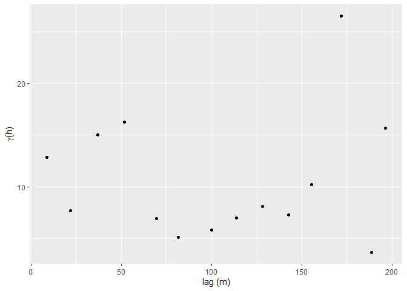<!-- -->

#### Ajustando modelos

``` r
patamar=10
alcance=40
epepita=1
modelo_1 <- fit.variogram(vari_exp,vgm(patamar,"Sph",alcance,epepita))
modelo_2 <- fit.variogram(vari_exp,vgm(patamar,"Exp",alcance,epepita))
modelo_3 <- fit.variogram(vari_exp,vgm(patamar,"Gau",alcance,epepita))
plot_my_models(modelo_1,modelo_2,modelo_3)
```

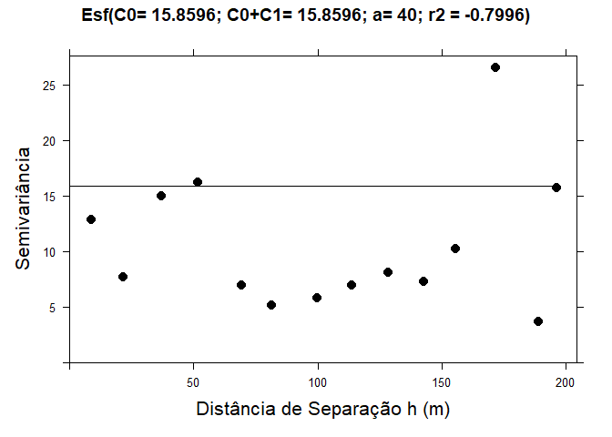<!-- --><!-- -->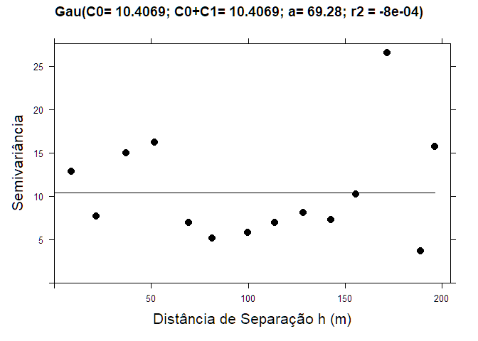<!-- -->

#### Escolha o melhor modelo (\>r²)

``` r
modelo <- modelo_2
```

#### Salvando os parâmetros ajustados

``` r
model <- modelo |> slice(2) |> pull(model)
rss <- round(attr(modelo, "SSErr"),4)
c0 <- round(modelo$psill[[1]],4)
c0_c1 <- round(sum(modelo$psill),4)
a <- ifelse(model == "Gau", round(modelo$range[[2]]*(3^.5),2),
            ifelse(model == "Exp",round(3*modelo$range[[2]],2),
            round(modelo$range[[2]],2)))
r2 <- vari_exp |> add_column( model = model, a=a, c0 = c0,
                                  c0_c1 = c0_c1) |>
    mutate(
      gamma_m = ifelse(model == "Sph",
        ifelse(dist <= a, c0 + (c0_c1 - c0) * (3/2 * (dist/a) - 1/2 * (dist/a)^3),c0_c1), ifelse(model == "Exp", c0 + (c0_c1-c0)*(1-exp(-3*(dist/a))),c0 + (c0_c1-c0)*(1-exp(-(dist/a)^2)))),
      residuo_total = (gamma-mean(gamma))^2,
      residuo_mod = (gamma - gamma_m)^2
    ) |>
    summarise(
      r2=(sum(residuo_total) - sum(residuo_mod))/sum(residuo_total)
    ) |> pull(r2)

tibble(
  pop, variavel, model, c0, c0_c1, a, rss, r2
) |> mutate(gde = c0/c0_c1, .after = "a") |>
  write_csv(paste0("output/best-fit/",str_replace_all(pop,"/| ","_"),"-",variavel,".csv"))

ls_csv <- list.files("output/best-fit/",full.names = TRUE,pattern = ".csv")
map_df(ls_csv, read_csv) |>
  arrange(pop,variavel) |> 
  writexl::write_xlsx("output/semivariogram-model.xlsx")
```
