Projeto Sucupira / Análise de Dados
================
2026-02-09

<!-- README.md is generated from README.Rmd. Please edit that file -->

## 👨‍🔬 Autores

- **Regivam Antonio de Saul**  
  Graduando em Agronomia - FEIS/Unesp  
  Email: <regivan.saul@unesp.br>

- **Witória de Oliveira Araujo**  
  Pós-graduando em Agronomia - FCAV/Unesp  
  Email: <witoria.araujo@unesp.br>

- **Rodrigo Baratiere Perim**  
  Pós-graduando em Agronomia - FCAV/Unesp  
  Email: <rodrigo.perim@unesp.br>

- **Prof. Dr. Alan Rodrigo Panosso**  
  Coorientador — Departamento de Ciências Exatas - FCAV/Unesp  
  Email: <alan.panosso@unesp.br>

- **Prof. Dr. Mario Luiz Teixeira de Moraes**  
  Coorientador — Departamento de Fitotecnia, Tecnologia de Alimentos e
  Sócio-Economia - FEIS/Unesp  
  Email: [mario.moraes@unesp.br](mailto:%20mario.moraes@unesp.br)

### Pré-processameto

``` r
library(tidyverse)
source("R/my-functions.R")
lsgo<-readxl::read_xlsx("data-raw/GO-LAG-Pop-Sucupira1.xlsx") |> 
  janitor::clean_names()
selms<-readxl::read_xlsx("data-raw/MS-SEL-Pop-Sucupira1.xlsx") |> 
  janitor::clean_names()
aposp<-readxl::read_xlsx("data-raw/SP-APO-Pop-Sucupira1.xlsx") |> 
  janitor::clean_names()
glimpse(aposp)
#> Rows: 40
#> Columns: 20
#> $ populacao    <chr> "Aparecida D'Oeste/SP", "Aparecida D'Oeste/SP", "Aparecid…
#> $ arv_matriz   <dbl> 1, 2, 3, 4, 5, 6, 7, 8, 9, 10, 11, 12, 13, 14, 15, 16, 17…
#> $ hc_m         <dbl> 8.50, 3.90, 5.10, 6.60, 2.00, 2.40, 4.60, 1.69, 4.80, 8.9…
#> $ ht_m         <dbl> 18.4, 18.7, 17.0, 25.0, 22.0, 16.8, 18.6, 17.7, 19.7, 29.…
#> $ dap_cm       <dbl> 75.477707, 7.324841, 55.095541, 7.961783, 66.560510, 4.77…
#> $ dmc_m        <dbl> 19.1, 15.4, 13.0, 18.2, 17.0, 15.3, 14.5, 18.9, 17.0, 16.…
#> $ eca_cm       <dbl> 1.5, 1.1, 1.3, 1.1, 1.5, 1.8, 0.8, 1.9, 2.1, 1.1, NA, NA,…
#> $ fruto        <dbl> 1, 1, 1, 1, 1, 1, 1, 1, 1, 0, NA, NA, 1, NA, NA, 0, 1, 1,…
#> $ mat_organica <dbl> 84.5, 89.1, 89.2, 86.3, 86.1, 84.0, 84.3, 83.8, 84.9, 86.…
#> $ p_h          <dbl> 3.77, 4.17, 4.14, 3.57, 3.36, 5.02, 4.81, 4.20, 4.07, 4.0…
#> $ p_h_smp      <dbl> 5.65, 6.16, 5.78, 5.61, 5.47, 6.43, 6.24, 6.21, 5.99, 5.8…
#> $ p_fosforo    <dbl> 3, 3, 2, 3, 4, 5, 3, 2, 11, 3, 3, 53, 4, 4, 2, 3, 9, 4, 3…
#> $ k_potacio    <dbl> 1.8, 2.4, 2.1, 2.0, 1.8, 2.8, 12.6, 9.6, 3.4, 2.0, 3.3, 2…
#> $ ca_calcio    <dbl> 11, 15, 4, 10, 5, 39, 23, 29, 13, 9, 21, 10, 11, 13, 5, 6…
#> $ mg_magnesio  <dbl> 4.5, 5.3, 3.6, 2.5, 3.0, 20.9, 17.4, 19.4, 13.4, 5.7, 8.4…
#> $ al_aluminio  <dbl> 0.81, 0.47, 0.95, 0.91, 1.16, 0.35, 0.14, 0.18, 0.30, 0.4…
#> $ s_enxofre    <dbl> 80.1, 82.6, 83.0, 80.5, 80.8, 65.9, 82.3, 71.2, 89.7, 82.…
#> $ easting      <dbl> 496694.8, 496687.6, 508134.9, 508234.1, 507978.1, 502296.…
#> $ northing     <dbl> 7728182, 7728117, 7733445, 7733453, 7731042, 7727737, 772…
#> $ altitude     <dbl> 351.7255, 349.5625, 364.2225, 361.5789, 351.2448, 343.313…
data_set <- rbind(lsgo,selms,aposp)
```

### Grid amostral e Gráficos

``` r
names_vari <- names(data_set |> select(hc_m:s_enxofre))
map(names_vari,~{
  plot_map <- data_set |>
    select(populacao,northing,easting,!!sym(.x)) |>
    group_by(populacao) |>
    mutate(
      classe = cut(!!sym(.x),3)
    ) |>
    ggplot(aes(x=easting, y=northing,colour = classe)) +
    geom_point() +
    facet_wrap(~populacao,scale="free",ncol=2)+
    theme_bw()+
    labs(
      colour = .x
    )
  
    plot_box <- data_set |> 
    select(populacao,northing,easting,!!sym(.x)) |> 
    group_by(populacao) |> 
    ggplot(aes(y=!!sym(.x), fill = populacao)) +
    geom_boxplot() +
    theme_bw()+
    labs(
      fill = "populacao"
    ) + scale_fill_viridis_d(option = "B")
    
    print(plot_map)
    print(plot_box)
})
```

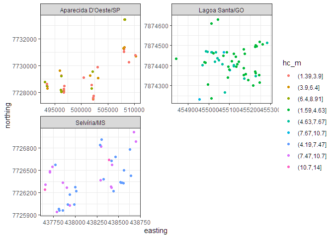<!-- --><!-- --><!-- --><!-- -->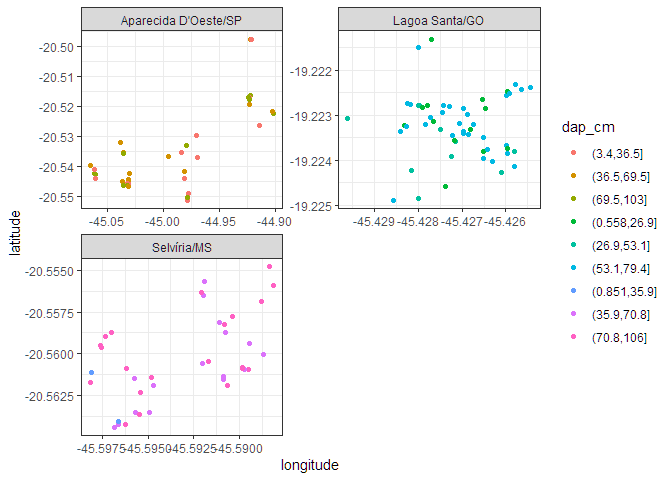<!-- --><!-- -->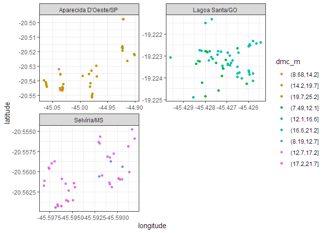<!-- -->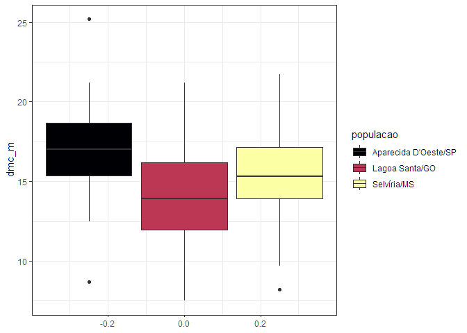<!-- --><!-- --><!-- --><!-- --><!-- -->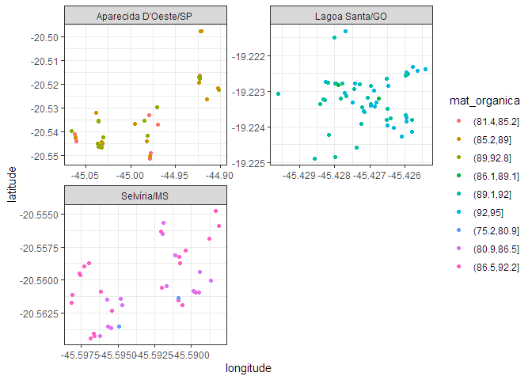<!-- --><!-- -->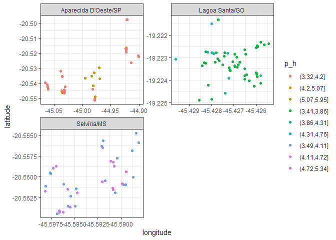<!-- --><!-- -->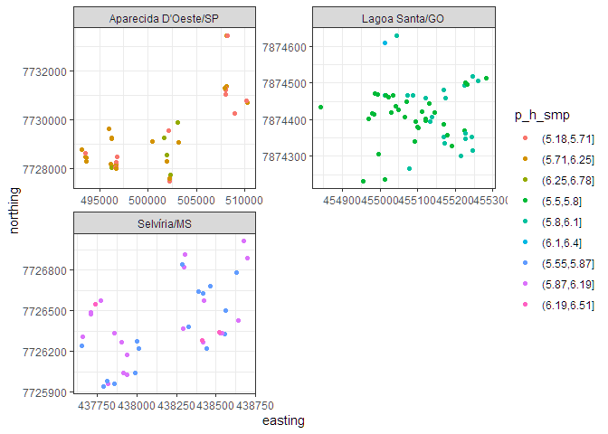<!-- --><!-- --><!-- --><!-- -->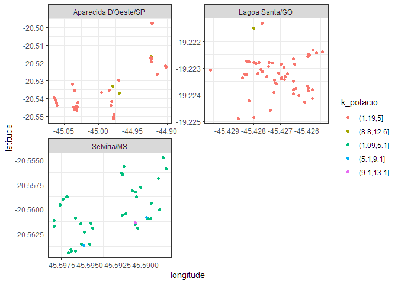<!-- --><!-- -->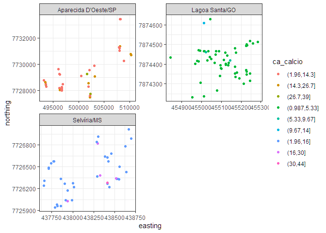<!-- --><!-- -->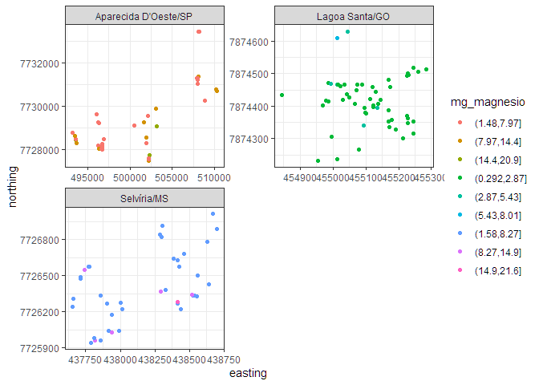<!-- --><!-- -->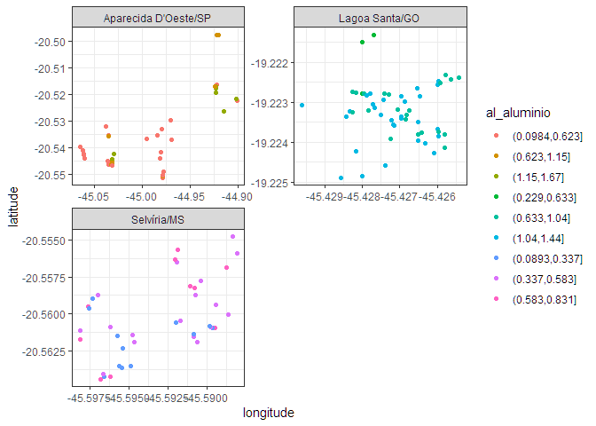<!-- --><!-- -->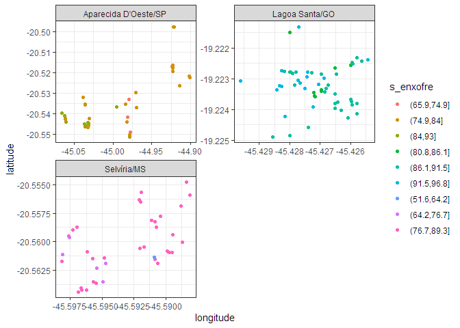<!-- --><!-- -->

    #> [[1]]

<!-- -->

    #> 
    #> [[2]]

<!-- -->

    #> 
    #> [[3]]

<!-- -->

    #> 
    #> [[4]]

<!-- -->

    #> 
    #> [[5]]

<!-- -->

    #> 
    #> [[6]]

<!-- -->

    #> 
    #> [[7]]

<!-- -->

    #> 
    #> [[8]]

<!-- -->

    #> 
    #> [[9]]

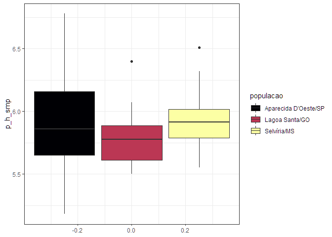<!-- -->

    #> 
    #> [[10]]

<!-- -->

    #> 
    #> [[11]]

<!-- -->

    #> 
    #> [[12]]

<!-- -->

    #> 
    #> [[13]]

<!-- -->

    #> 
    #> [[14]]

<!-- -->

    #> 
    #> [[15]]

<!-- -->

### Estatística Descritiva

``` r
data_set |> 
  select(populacao, hc_m:s_enxofre) |> 
  group_by(populacao) |> 
  summarise( across(
    .cols = hc_m:s_enxofre,
    .fns = estat_desc,
    .names = "{.col}"
  )) |>
  ungroup() |> 
  add_column(estat = rep(estat_names,3)) |> 
  relocate(estat) |> 
  writexl::write_xlsx("output/estatistica-descritiva.xlsx")
  
```
